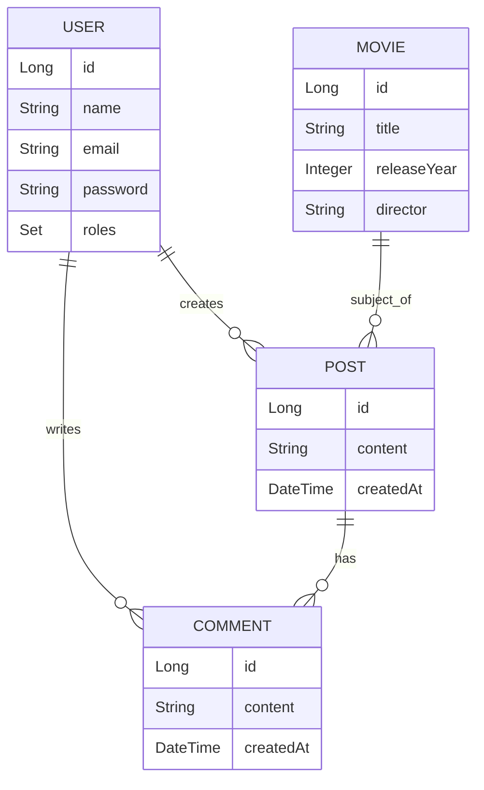

<div align="center">
  <div align="center">
  

# Muviz

[](https://github.com/yourusername/muviz)
[](LICENSE)
[](https://www.oracle.com/java/)
[](https://spring.io/projects/spring-boot)

Una plataforma moderna para compartir y descubrir opiniones sobre películas.

</div>

---

## 📋 Índicee

- [Introducción](#-introducción)
- [Problema y Solución](#-problema-y-solución)
- [Características](#-características)
- [Tecnologías](#-tecnologías)
- [Modelo de Datos](#-modelo-de-datos)
- [Seguridad](#-seguridad)
- [Testing](#-testing)
- [Eventos y Asincronía](#-eventos-y-asincronía)
- [Desarrollo](#-desarrollo)
- [Conclusión](#-conclusión)
- [Licencia](#-licencia)

---

## 🎬 Introducción

**Muviz** nace en el contexto del curso de Desarrollo Basado en Plataformas (DBP), con el objetivo de crear un espacio donde los amantes del cine puedan compartir sus pensamientos y descubrir nuevas películas.

**Objetivos:**

- 🛠 Desarrollar una API RESTful robusta
- 🔐 Implementar un sistema de autenticación seguro
- 👥 Fomentar una comunidad activa de cinéfilos

---

## 🎯 Problema y Solución

### El Desafío

Muchas plataformas actuales de reseñas de películas carecen de:

- 🔒 Sistemas de autenticación robustos
- 🧹 Mecanismos efectivos contra spam
- 🤝 Enfoque centrado en la comunidad

### Nuestra Respuesta

Muviz aborda estos problemas ofreciendo:

- 🛡 Autenticación segura con JWT
- 🎭 Sistema de roles para moderar contenido
- 💬 Interacciones enriquecedoras entre usuarios

---

## ✨ Características

1. **🔐 Autenticación Avanzada**

   - Registro de usuarios
   - Login seguro
   - Gestión de tokens JWT

2. **👤 Gestión de Usuarios**

   - Perfiles personalizables
   - Roles: USER, MODERATOR, ADMIN

3. **🎥 Catálogo de Películas**

   - Búsqueda y filtrado
   - Información detallada

4. **📝 Sistema de Posts**

   - Crear, leer, actualizar y eliminar reseñas
   - Interacción con otros usuarios

5. **💬 Comentarios**
   - Discusiones en tiempo real
   - Notificaciones

---

## 💻 Tecnologías

- **Backend:**

  - 
  - 

- **Seguridad:**

  - 

- **Base de Datos:**

  - 
  - 

- **Herramientas:**
  - 
  - 
  - 

---

## 📊 Modelo de Datos



---

## 🔒 Seguridad

- **🔑 JWT Authentication**
- **🔐 Password Encryption:** BCrypt
- **🚦 Role-based Access Control**
- **🛡 CORS Configuration**
- **🚫 Rate Limiting**

---

## 🧪 Testing

### Niveles

- ✅ Unit Testing
- 🔄 Integration Testing
- 🌐 API Testing

### Manejo de Errores

```java
@ControllerAdvice
public class GlobalExceptionHandler {
    @ExceptionHandler(value = {Exception.class})
    public ResponseEntity<Object> handleException(Exception ex) {
        // Lógica de manejo de excepciones
    }
}
```

---

## ⚡ Eventos y Asincronía

```java
@Async
@EventListener
public void handleUserRegisteredEvent(UserRegisteredEvent event) {
    // Envío asíncrono de correo de bienvenida
    emailService.sendWelcomeEmail(event.getUserEmail());
}
```

---

## 👨‍💻 Desarrollo

El proyecto sigue las mejores prácticas de desarrollo:

- 🌿 Branching estratégico
- 👀 Code reviews vía Pull Requests
- 🎫 Tracking de issues
- 🔄 Flujo de trabajo Gitflow

---

## 🎉 Conclusión

Muviz representa un hito significativo en nuestro aprendizaje, demostrando:

- 🏗 Arquitectura robusta
- 🔐 Implementación de seguridad avanzada
- 🚀 Eficiencia mediante programación asíncrona

**Próximos Pasos:**

1. 🖥 Desarrollo de frontend
2. 🧠 Sistema de recomendaciones
3. 🌐 Integración con APIs externas de películas

---

## 📄 Licencia

Este proyecto está bajo la Licencia MIT. Ver el archivo [LICENSE](LICENSE) para más detalles.

---

<div align="center">
  Desarrollado con ❤️ por el equipo de Muviz
</div>
