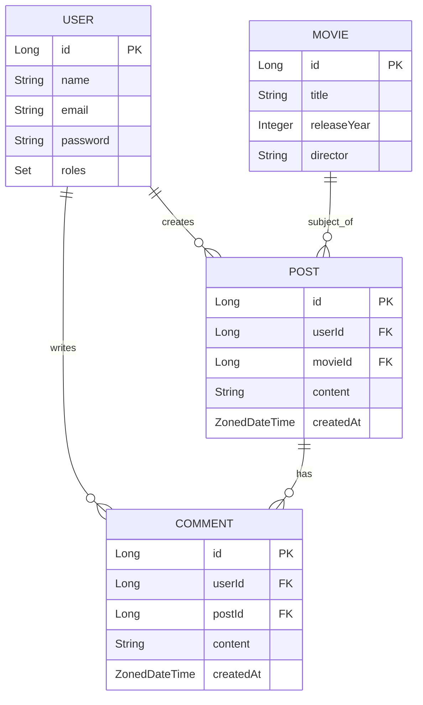

<div align="center">
  

# Muviz: Red Social para Cinéfilos

[](https://www.oracle.com/java/)
[](https://spring.io/projects/spring-boot)

CS 2031 Desarrollo Basado en Plataforma

Desarrollado por:
- Mateo Ismael Rodriguez Ramos

</div>

## Índice

- [Introducción](#introducción)
- [Identificación del Problema o Necesidad](#identificación-del-problema-o-necesidad)
- [Descripción de la Solución](#descripción-de-la-solución)
- [Modelo de Entidades](#modelo-de-entidades)
- [Testing y Manejo de Errores](#testing-y-manejo-de-errores)
- [Medidas de Seguridad Implementadas](#medidas-de-seguridad-implementadas)
- [Eventos y Asincronía](#eventos-y-asincronía)
- [GitHub](#github)
- [Conclusión](#conclusión)
- [Apéndices](#apéndices)

## Introducción

### Contexto

Muviz nace como un proyecto para el curso de Desarrollo Basado en Plataformas (DBP), con el objetivo de crear una plataforma donde los amantes del cine puedan compartir sus opiniones y descubrir nuevas películas.

### Objetivos del Proyecto

1. Desarrollar una API RESTful para una red social de cinéfilos.
2. Implementar un sistema de autenticación y autorización seguro.
3. Crear funcionalidades para compartir opiniones sobre películas.
4. Aplicar los conocimientos adquiridos en el curso de DBP.

## Identificación del Problema o Necesidad

### Descripción del Problema

Muchas plataformas actuales de reseñas de películas carecen de:
- Sistemas de autenticación robustos.
- Mecanismos efectivos para moderar el contenido.
- Un enfoque centrado en la comunidad de cinéfilos.

### Justificación

Muviz busca abordar estas carencias proporcionando:
- Una plataforma segura y dedicada para los amantes del cine.
- Un sistema de roles para gestionar el contenido y las interacciones.
- Un espacio para compartir y discutir sobre películas de manera estructurada.

## Descripción de la Solución

### Funcionalidades Implementadas

1. **Sistema de Autenticación y Autorización**
    - Registro y login de usuarios con JWT.
    - Roles de usuario (USER, MODERATOR, ADMIN).

2. **Gestión de Películas**
    - CRUD de películas (implementado para todos los usuarios, pendiente de restringir por roles).

3. **Sistema de Posts**
    - Creación, lectura, actualización y eliminación de posts sobre películas.

4. **Sistema de Comentarios**
    - Creación, lectura, actualización y eliminación de comentarios en posts.

5. **Perfil de Usuario**
    - Obtención de información del usuario actual.

### Tecnologías Utilizadas

- **Backend**: Java con Spring Boot
- **Seguridad**: Spring Security con JWT
- **Base de Datos**: Docker / PostgreSQL
- **Manejo de Dependencias**: Maven

## Modelo de Entidades



### Descripción de Entidades

- **User**: Almacena información de los usuarios, incluyendo sus roles.
- **Movie**: Contiene detalles de las películas.
- **Post**: Representa las publicaciones de los usuarios sobre películas.
- **Comment**: Almacena los comentarios en los posts.

## Manejo de Errores

Se ha implementado un sistema global de manejo de excepciones:

```java
@ControllerAdvice
public class GlobalExceptionHandler {
    @ExceptionHandler(ResourceNotFoundException.class)
    public ResponseEntity<?> resourceNotFoundException(ResourceNotFoundException ex, WebRequest request) {
        ErrorDetails errorDetails = new ErrorDetails(LocalDateTime.now(), "Error 404 - Not Found", ex.getMessage(), request.getDescription(false));
        return new ResponseEntity<>(errorDetails, HttpStatus.NOT_FOUND);
    }

    @ExceptionHandler(Exception.class)
    public ResponseEntity<?> globalExceptionHandler(Exception ex, WebRequest request) {
        ErrorDetails errorDetails = new ErrorDetails(LocalDateTime.now(), "Error 500 - Internal Server Error", ex.getMessage(), request.getDescription(false));
        return new ResponseEntity<>(errorDetails, HttpStatus.INTERNAL_SERVER_ERROR);
    }

    @ExceptionHandler(ForbiddenAccessException.class)
    public ResponseEntity<?> handleForbiddenAccessException(ForbiddenAccessException ex, WebRequest request) {
        ErrorDetails errorDetails = new ErrorDetails(LocalDateTime.now(), "Error 403 - Forbidden", ex.getMessage(), request.getDescription(false));
        return new ResponseEntity<>(errorDetails, HttpStatus.FORBIDDEN);
    }
}
```

Este sistema permite un manejo consistente de errores en toda la aplicación.

## Medidas de Seguridad Implementadas

1. **Autenticación con JWT**: Se utiliza JSON Web Tokens para la autenticación de usuarios.
2. **Roles de Usuario**: Implementación de roles (USER, MODERATOR, ADMIN) para control de acceso.
3. **Encriptación de Contraseñas**: Se utiliza BCrypt para el hash de contraseñas.
4. **CORS**: Configuración de CORS para controlar el acceso desde diferentes orígenes.
5. **Rate Limiting**: Implementado para prevenir ataques de fuerza bruta.

Ejemplo de configuración de seguridad:

```java
@Configuration
@EnableWebSecurity
@EnableMethodSecurity
public class SecurityConfig {
    @Bean
    public SecurityFilterChain securityFilterChain(HttpSecurity http) throws Exception {
        http
            .csrf(AbstractHttpConfigurer::disable)
            .cors(cors -> cors.configurationSource(corsConfigurationSource()))
            .authorizeHttpRequests(auth -> auth
                .requestMatchers("/auth/**").permitAll()
                .requestMatchers("/users/me").authenticated()
                .requestMatchers("/users/**").hasAnyRole("ADMIN")
                .requestMatchers("/movies/**").hasAnyRole("ADMIN", "MODERATOR")
                .requestMatchers(HttpMethod.GET, "/posts/**", "/comments/**").authenticated()
                .requestMatchers(HttpMethod.POST, "/posts/**", "/comments/**").authenticated()
                .requestMatchers(HttpMethod.PUT, "/posts/**", "/comments/**").authenticated()
                .requestMatchers(HttpMethod.DELETE, "/posts/**", "/comments/**").authenticated()
                .anyRequest().authenticated()
            )
            .sessionManagement(manager -> manager.sessionCreationPolicy(SessionCreationPolicy.STATELESS))
            .authenticationProvider(authenticationProvider())
            .addFilterBefore(jwtAuthenticationFilter(), UsernamePasswordAuthenticationFilter.class);

        return http.build();
    }
}
```

## Eventos y Asincronía

Se ha implementado un sistema de eventos asíncronos para el envío de correos electrónicos de bienvenida:

```java
@Component
public class EmailListener {
    @Autowired
    private EmailService emailService;

    @EventListener
    @Async
    public void handleUserRegistrationEvent(UserRegistrationEvent event) {
        try {
            emailService.sendTemplateMessage(event.getEmail(), event.getSubject(), event.getTemplateName(), event.getVariables());
        } catch (MessagingException e) {
            e.printStackTrace();
        }
    }
}
```

Este enfoque permite enviar correos electrónicos de forma asíncrona, mejorando la respuesta del servidor.

## Conclusión

### Logros del Proyecto

1. Desarrollo de una API RESTful funcional para una red social de cinéfilos.
2. Implementación de un sistema de autenticación y autorización basado en JWT.
3. Creación de funcionalidades para compartir opiniones sobre películas.

### Aprendizajes Clave

1. Implementación práctica de seguridad en aplicaciones web con Spring Security.
2. Diseño y desarrollo de una API RESTful.
3. Manejo de relaciones entre entidades en una base de datos.

### Trabajo Futuro

1. Desarrollar un frontend para la aplicación.
2. Mejorar el sistema de recomendaciones de películas.

## Apéndices

### Licencia

[Información sobre la licencia no proporcionada]

### Referencias

- Spring Framework Documentation. (2023). https://spring.io/projects/spring-framework
- JWT.io. (2023). JSON Web Tokens. https://jwt.io/
